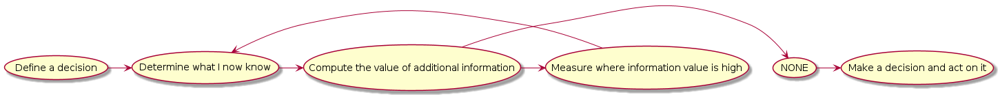

# How to Measure Anything: Finding the Value of Intangibles in Business

# Session 1
## Chapter 1
* What I perceive as hard to measure/quantify:
  * *"How to measure value of core values of an Organisation"*
  * *"How to measure expected happiness moving to a a new neighbourhood"*
* Care about a given measurement as it informs a decision
  * measurement is supporting decision
* Method to analyse options to reduce uncertainty when taking decisions
* AIE - Applied Information Economics

<!--
```
@startuml images/aie_method
!include diagrams/aie_method.puml
@enduml
```
-->


* Its about reducing uncertainty, any delta is useful as the decision will be more informed and less uncertain.
* We don't need to be perfect

## Chapter 2
* Fermi
  * Fermi questions
    * to set delta 0 - understand our current understanding of something as a precursor to further measurement
  * confetti + blast radius
* Eratosthenes -> circumference
* small observations combined with facts gave answers to big questions
* Emily's more basic question "the ability to feel energy field" instead of measuring patient's health
  * simplified experiment extremely

## Chapter 3
* Misconceptions
  * Concept of measurement - measurement definitions misunderstood
  * Object of measurement - not well defined enough
  * Method of measurement - many procedures of empirical observations not well known

* "If we incorrectly think that measurement means meeting some nearly
  unachievable standard of certainty, then few things will be
  measurable even in the physical sciences"
* Definition of Measurement, Information Theory version - "A
  quantitatively expressed reduction of uncertainty based on one or
  more observations."
* Stanley Smith Stevens, on the theory of scales and measurement: nominal, ordinal, interval, ratio
  * i.e it doesn't have to always be ratio scale, nominal set membership statements still is a measurement.
* Clarification Chain
  1. if it matters at all, it is detectable/observable.
  2. If it is detectable, it can be detected as an amount (or range of possible amounts)
  3. If it can be detected as a range of possible amounts, it can be measured
* Rule of five: There is a 93.75% chance that the median of a population is between the smallest and largest values in any random sample of five from the that population
  * chance of getting heads five times in a row = 1/2 * 1/2 * 1/2 * 1/2 * 1/2 = 1/32 = 3.125%. The chance of not getting all heads or tails is then 100% - 3.125% * 2 or 93.75%.
* The urn of Mystery (The single sample Majority Rule)
* "If you don't know what to measure, measure it anyway. You'll learn what to measure" - David Moore
* "In most business cases, most of the variables have an 'information value' at or near zero. But usually at least some variables have an information value that is so high that some deliberate measurement effort is easily justified"
* Gaming measurement - School that dropped low-achieving students
* Measuring what we know to measure isn't what we should be measuring - not measuring what matters most
* Four useful measurement assumptions
  1. It's been measured before
    * Your situation isn't as unique as you think
  2. You have far more data than you think.
    * Indirect information, think Eratosthenes
  3. You need far less data than you think.
    * when you know almost nothing, almost anything will tell you something
  4. Useful, new observations are more accessible than you think
    * Measuring Orchestra performance - simple measurement of measuring number of standing ovations
* Think of measurement as iterative. Experiment, makes an attempt, MVP in product thinking?

## Chapter 4

* A decision has uncertainty.. There have to be two or more choices and _the best c hoice is not certain_
* Oversimplified model: 
  * Estimated Cost of Action X.
  * Estimated Benefits of Action X.
  * If Benefit of Action X exceed Cost of Action X, execute X.
  * Decompose a la Fermi into more detail
* Donald G. MacGregor and J. S. Armstrong "Judgemental Decomposition: When does it work?" 
  * Fermis decomposition improves estimates where error rates are high when you estimate without decomposition. Estimating circumference of a coin vs estmating number of total auto accidents per year.
* The definitions of Uncertainty, Risk and their measurements. Page 84.
  * measuring uncertainty and risk involves assigning probabilities
  * A reduction in risk must mean that the probability and/or severity (loss) decreases for a particular list of events.
* The IT security example is very good to describe when it's unclear what is being reduced in terms of uncertainty and risk.
  * Improved IT security means a reduction in the frequency and severity of a specific list of undesierable events.
    * Each event would have impacts represented as a specific combination of costs. 
      * Example: Average annual cost of virus attacks = no of attacks * avg number of people affected * avg productivity loss * avg duration of downtime * annual cost of labor * 2,080 hours per year.
* Page 89, effects table, what I didn't like. Uncertain variable: Agancy wide virut attacks per year, 90% likelty to fall between 2 and 4. 
  * "These ranges may seem merely subjective ... but the subjective estimates of some persons are demonstrably - measurably - better than those of others" - How do you quantify this? How do you measure the calibration of an experts opinion? 

## Chapter 5

* Confidence Interval
  * Why 90%? For the same reasons why choose to look at 90,95% percentiles. shaving off the extreme values (impossible values or highly unlikely) to observe patterns (imho)
 * Calibration exercises
  * Reptition and feedback.
  * Equivalent bets: test if my interval or probablity actually reflects my uncertainty
  * avoid anchoring. Think of range questions as two seperate binary questions  of the form "are you 95% certain that the true value is over/under the lower/upper bound?
  * Reverse the anchoring effect. Start with extremely wide ranges and anarrow them with the "absurdity test" as I eliminate highly unlikely values.
  * The conceptual obstacles to calibration sections were interesting
 * If you're allowed to model your uncertainty with ranges and probablilities you don't have to state something you don't know for a fact.
 * if you have "no idea" that a narrow range is correct, you simply widen it until it reflects what you do know - with 90% confidence.
 * Enrico Fermi: there were ways to come to reasonable ranges, there is nothing we will likely ever need to measure where our only bounds are negative infinity to positive infinity.
 * they have been taught in business. the lack of an exact number is the same as knowing nothing or perhaps because they will be held accountable for a number.
 * Horace: "There is a measure in everything. There are fixed limits beyond which and short of which right cannot find a resting place"
 * Your objective is to state a range that represent you 90% CI... means you think there is a 5% chance the value is below my lower bound and 5% chance that the value is above our upper bound.
 * Modeling my initial uncertainty is an interim step, not the end goal. So that we can decide if we need to obtain more data by measuring more or if we can act on it (AIE).

<!--  LocalWords:  startuml aie puml enduml png
 -->
